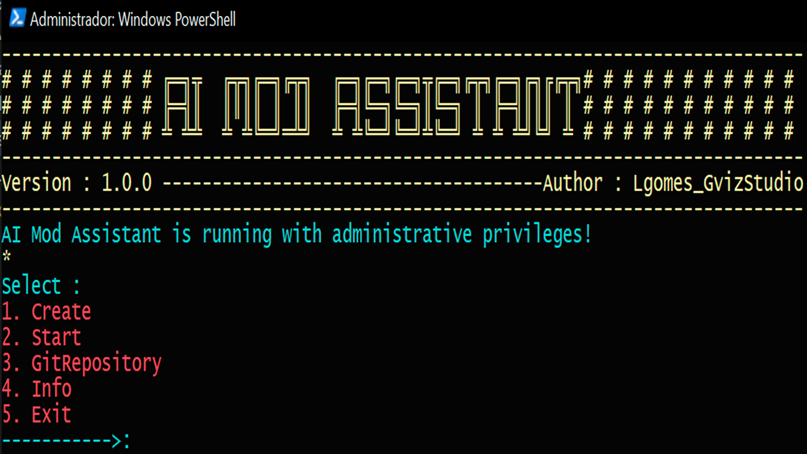
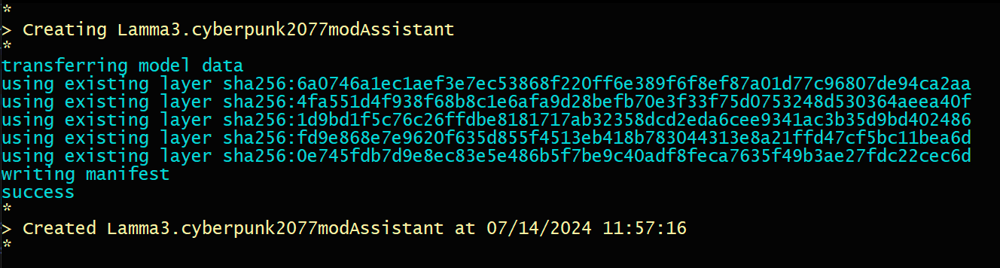

# AI MOD ASSISTANT

---

### Game: CYBERPUNK2077
### Model: LLama3
### Version: 1.0.0

---
AI assistant that will give answers about modding and creating mods for Cyberpunk2077.

---

## REQUIREMENTS

- **Windows PowerShell**
- **Ollama**: [Download](https://ollama.com/download)
- **Python**: [Download](https://www.python.org/downloads/)
- **BeautifulSoup4**:
  ```sh
  pip install requests beautifulsoup4

## DEFAULT USAGE

**Compile AI_Mod_Assit.py**
- this will Open AI mod Assistant in your Windows PowerShell




1. **Create the AI model Assistant.**

- Ollama you Download LLama3 And use Lamma3.cyberpunk2077modAssistantFile to build your Custom AI Model


2. **Start AI Assistant**
   - If you have created the AI Mod Assistant This Selection will start an conversation with it
   - Send your message to AI Assistant.
   - Send `/?` for Ollama Helper.


3. **GitHub Repository Link**
-Open GithubRepository on your Browser


4. **System and AI Assistant Info**
-Print on WindowsPower Shell the system info

5. **Close**
-Close this Application

---

## TUNNING AND EXTRAS

**Lamma3.cyberpunk2077modAssistantFile**

- This file is the model file for Ollama to create the AI assistant model.
- It can be edited for better performance, specify use cases, or assist in other tasks.

**Edit and Compile Link_Extraction.py**

- Use this script to extract links from an page and build your own data for the AI model.
- [More info at Meta Llama 3 Model Cards and Prompt Formats](https://llama.meta.com/docs/model-cards-and-prompt-formats/meta-llama-3/#model-card)

---
## AI Assistant  Overview Video
https://www.youtube.com/watch?v=HVmKtV3hIbE

---

*By Lgomes_GvizStudio*
